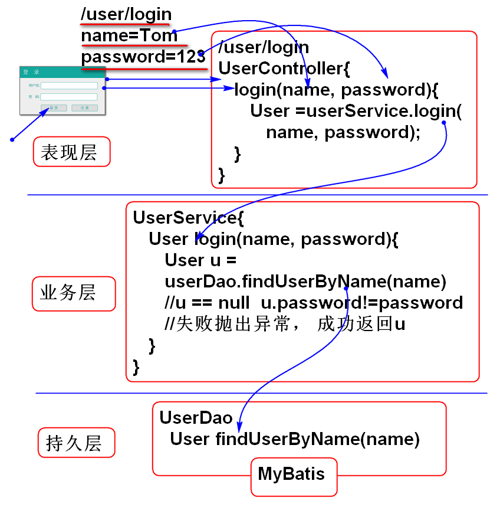
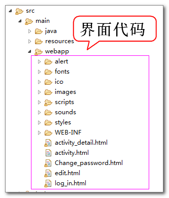

# 云笔记

## 登录功能

设计思路：

实现步骤：

1. 添加数据持久层方法并且测试
2. 添加业务层方法并且测试
3. 添加控制器并且测试
4. 界面整合
	- 在节目中用Jquery调用控制器

### 1. 添加数据持久层方法并且测试

添加持久层方法 UserDao.java:

	User findUserByName(String name);

添加SQL语句： UserMapper.xml:

	<select id="findUserByName"
		parameterType="string"
		resultType="cn.tedu.note.entity.User">
		select 
			cn_user_id as id,  
			cn_user_name as name,
			cn_user_password as password,
			cn_user_token as token,
			cn_user_nick as nick
		from 
			cn_user
		where
			cn_user_name=#{name}
	</select>	

测试：

	@Test
	public void testFindUserByName(){
		UserDao dao = ctx.getBean(
			"userDao", UserDao.class);
		String name="Tom";
		User user=dao.findUserByName(name);
		System.out.println(user); 
	}

### 2. 添加业务层方法并且测试

添加业务层接口： UserService.java

	public interface UserService {
		
		User login(String name, String password)
			throws UserNameException,
			PasswordException;
		
	}

实现业务方法：

	@Service("userService")
	public class UserServiceImpl
		implements UserService{
		
		@Autowired
		private UserDao userDao;
		
		public User login(String name, 
				String password) 
				throws UserNameException, 
				PasswordException {
			//检验输入参数的合理性
			if(name==null||name.trim().isEmpty()){
				throw new UserNameException("名不能空");
			}
			String reg = "^\\w{3,10}$";
			if(! name.matches(reg)){
				throw new UserNameException("不合规");
			}
			if(password==null||password.trim().isEmpty()){
				throw new PasswordException("不能空");
			}
			if(! password.matches(reg)){
				throw new PasswordException("不合规");
			}
			//查询用户数据
			User user=userDao.findUserByName(name);
			if(user==null){
				throw new UserNameException("错误");
			}
			if(user.getPassword().equals(password)){
				//业务处理
				//登录成功，返回用户信息
				return user;
			}
			throw new PasswordException("密码错");
		}
	}

> 建议：合理检验输入参数！！！

添加Spring配置文件，初始化userService组件，spring-service.xml：
	
	<?xml version="1.0" encoding="UTF-8"?>
	<beans xmlns="http://www.springframework.org/schema/beans" 
		xmlns:xsi="http://www.w3.org/2001/XMLSchema-instance"
		xmlns:context="http://www.springframework.org/schema/context" 
		xmlns:jdbc="http://www.springframework.org/schema/jdbc"  
		xmlns:jee="http://www.springframework.org/schema/jee" 
		xmlns:tx="http://www.springframework.org/schema/tx"
		xmlns:aop="http://www.springframework.org/schema/aop" 
		xmlns:mvc="http://www.springframework.org/schema/mvc"
		xmlns:util="http://www.springframework.org/schema/util"
		xmlns:jpa="http://www.springframework.org/schema/data/jpa"
		xsi:schemaLocation="
			http://www.springframework.org/schema/beans http://www.springframework.org/schema/beans/spring-beans-3.2.xsd
			http://www.springframework.org/schema/context http://www.springframework.org/schema/context/spring-context-3.2.xsd
			http://www.springframework.org/schema/jdbc http://www.springframework.org/schema/jdbc/spring-jdbc-3.2.xsd
			http://www.springframework.org/schema/jee http://www.springframework.org/schema/jee/spring-jee-3.2.xsd
			http://www.springframework.org/schema/tx http://www.springframework.org/schema/tx/spring-tx-3.2.xsd
			http://www.springframework.org/schema/data/jpa http://www.springframework.org/schema/data/jpa/spring-jpa-1.3.xsd
			http://www.springframework.org/schema/aop http://www.springframework.org/schema/aop/spring-aop-3.2.xsd
			http://www.springframework.org/schema/mvc http://www.springframework.org/schema/mvc/spring-mvc-3.2.xsd
			http://www.springframework.org/schema/util http://www.springframework.org/schema/util/spring-util-3.2.xsd">
	
		<!-- 扫描到控制器组件 -->
		<context:component-scan 
			base-package="cn.tedu.note.service"/>
	</beans>

测试：

	public class UserServiceTestCase {
		
		ClassPathXmlApplicationContext ctx;
		@Before
		public void init(){
			ctx = new ClassPathXmlApplicationContext(
				"spring-web.xml",
				"spring-mybatis.xml",
				"spring-service.xml");
		}
	
		@Test
		public void testLogin(){
			UserService service=ctx.getBean(
				"userService",
				UserService.class);
			String name="Tom";
			String password="123";
			User user = service.login(
				name, password);
			System.out.println(user); 
		}
		
	}

> 提示： 应该对全部流程进行全面覆盖测试。

### 3. 添加控制器并且测试

添加控制器类：
	
	 
	@Controller
	@RequestMapping("/user")
	public class UserController {
		
		@Resource
		private UserService userService;
		
		@RequestMapping("/login.do")
		@ResponseBody
		public JsonResult<User> login(String name,
				String password){
			try{
				User user = 
					userService.login(name, password);
				return new JsonResult<User>(user);
			}catch(PasswordException e){
				e.printStackTrace();
				return new JsonResult<User>(3,e);
			}catch(UserNameException e){
				e.printStackTrace();
				return new JsonResult<User>(2,e);
			}catch(Exception e){
				e.printStackTrace();
				return new JsonResult<User>(e);
			}
		}

		 
	}
	
添加JsonResult 用于封装，Json返回值

	
	public class JsonResult<T> 
		implements Serializable{
		
		private static final long serialVersionUID = -7330453556127986084L;
		public static final int SUCCESS=0;
		public static final int ERROR=1;
		
		private int state;
		private T data;
		private String message;
		
		public JsonResult() {
		}
		
		public JsonResult(T t){
			state = SUCCESS;
			data = t;
			message="";
		}
		
		public JsonResult(Throwable e){
			state = ERROR;
			data=null;
			message = e.getMessage();
		}
	
		public JsonResult(int state, 
				Throwable e) {
			this.state = state;
			this.message = e.getMessage();
			this.data = null;
		}
	
		public int getState() {
			return state;
		}
	
		public void setState(int state) {
			this.state = state;
		}
	
		public T getData() {
			return data;
		}
	
		public void setData(T data) {
			this.data = data;
		}
	
		public String getMessage() {
			return message;
		}
	
		public void setMessage(String message) {
			this.message = message;
		}
	}

部署到服务器进行测试：
	
	正确测试：
	http://localhost:8080/note/user/login.do?name=Tom&password=123

	异常测试：
	http://localhost:8080/note/user/login.do 

### 4. 界面整合

在界面中用Jquery调用控制器, 实现登录功能。

将界面代码复制到项目中：

更新log_in.html, 添加脚本引用：

	
	

添加JS代码, 绑定界面组件控件 login.js:

	$(function(){
		//为登录按钮绑定单击事件
		$('#login').click(loginAction);
		$('#count').focus().blur(checkName);
		$('#password').blur(checkPassword);
	});

添加 用户名检查 方法：
	
	function checkName(){
		var name = $('#count').val();
		if(name==null || name==""){
			//提示错误
			$('#count-msg').html('不能空');
			return false;
		}
		var reg = /^\w{3,10}$/;
		if(! reg.test(name)){
			$('#count-msg').html('长度不对');
			return false;
		}
		$('#count-msg').empty();
		return true;
	} 

添加检查密码的方法：

	function checkPassword(){
		var password = $('#password').val();
		if(password==null || password==""){
			//提示错误
			$('#password-msg').html('不能空');
			return false;
		}
		var reg = /^\w{3,10}$/;
		if(! reg.test(password)){
			$('#password-msg').html('长度不对');
			return false;
		}
		$('#password-msg').empty();
		return true;
	}

为了配合用户名和密码检查，在界面log_in.html上 用户名和密码框后面增加显示错误的标签span：

	
	
	
						

添加登录按钮事件方法：

	//登录按钮的动作
	function loginAction(){
		console.log('login click!');
		//收集用户名和密码数据
		var name = $('#count').val();
		var password = $('#password').val();
		//验证用户名和密码
		var pass = checkName()+checkPassword();  
		if(pass!=2){
			return;
		}
		var paramter={'name':name, 
				'password':password};
		//发送Ajax请求
		$.ajax({
			url:'user/login.do',
			data:paramter,
			dataType:'json',
			type:'POST',
			success:function(result){
				//{state:0,data:, message}
				if(result.state==0){//SUCCESS
					console.log("SUCCESS");
					console.log(result.data);
					location.href='edit.html';
					return;
				}else if(result.state==2){
					//用户名错误
					$('#count-msg').html(result.message);
					return;
				}else if(result.state==3){
					//密码错误
					$('#password-msg').html(result.message);
					return;
				}
				alert(result.message);
			},
			error:function(){
				alert('Ajax请求失败');
			}
		});
		
	}

测试：

1. 先利用浏览器分别测试 checkName 和 checkPassword
2. 再利用浏览器测试 loginAction
3. 局部问题，可以利用console.log() 打桩调试。
4. 如果有通信故障，请利用浏览器提供的 Network 功能检查网络协议，查找故障位置。

## Good Luck!

-------------------------------

## 作业 

实现登录功能。

	